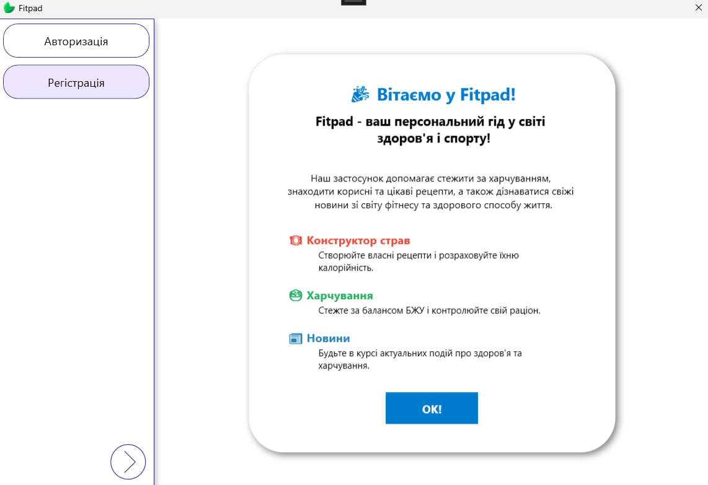
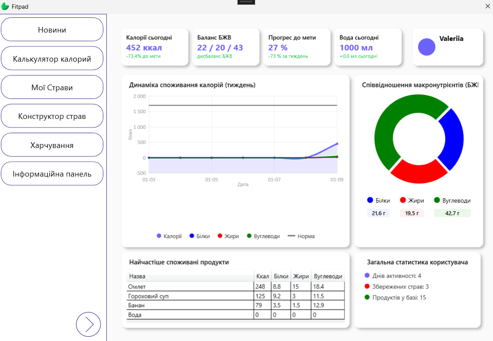
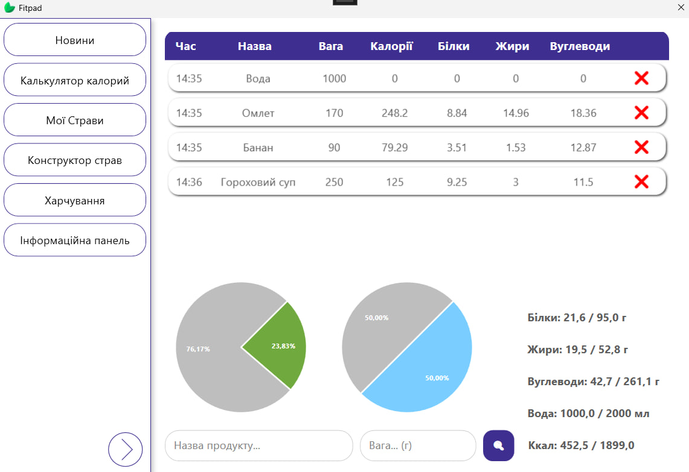
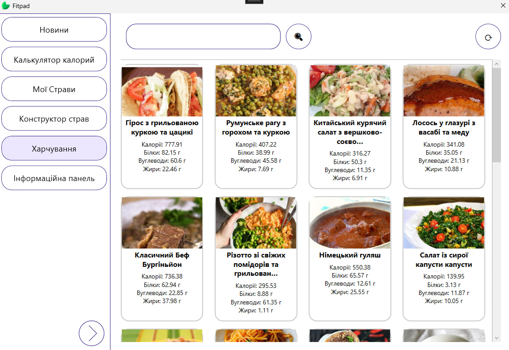
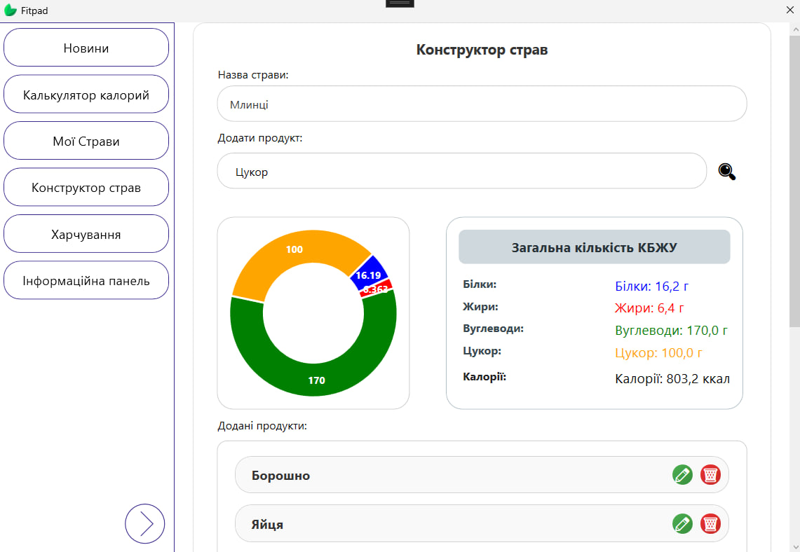
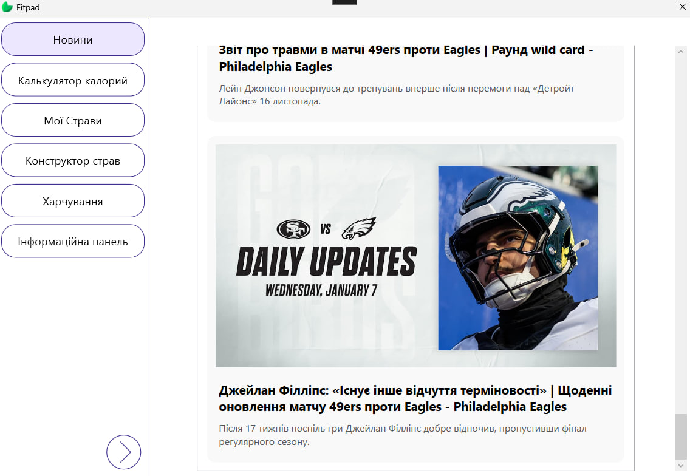

<div align="right">

[EN](./README.md) | [UA](./README.uk.md)

</div>

<div align="center">

# 🍃 Fitpad

**Your Personal Fitness & Nutrition Companion**

[](https://dotnet.microsoft.com/)
[](https://docs.microsoft.com/en-us/dotnet/desktop/wpf/)
[](https://firebase.google.com/)
[](LICENSE)

</div>

---

## 📋 Table of Contents

- [About](#-about)
- [Features](#-features)
- [Screenshots](#-screenshots)
- [Tech Stack](#-tech-stack)
- [Getting Started](#-getting-started)
  - [Prerequisites](#prerequisites)
  - [Installation](#installation)
  - [Configuration](#configuration)
- [Security](#-security)
- [Project Structure](#-project-structure)
- [Contributing](#-contributing)
- [License](#-license)

---

## 🎯 About

**Fitpad** is a comprehensive Windows desktop application designed to help users manage their fitness journey, track nutrition, and achieve their health goals. Built with WPF and powered by Firebase Firestore, it offers a seamless experience for tracking daily meals, calculating nutritional values, and staying updated with fitness news.

### Key Highlights

- 📊 **Nutrition Tracking**: Log your daily meals and monitor calorie intake
- 🍽️ **Recipe Management**: Create and manage custom dishes with nutritional information
- 📰 **Fitness News**: Stay informed with auto-translated fitness articles
- 🎯 **Goal Setting**: Set and track your fitness objectives
- 🔐 **Secure**: BCrypt password hashing and environment-based configuration

---

## ✨ Features

### User Management
- ✅ Secure user registration with email validation
- ✅ BCrypt password hashing (work factor 12)
- ✅ User profiles with age, height, weight, and activity level
- ✅ Persistent authentication sessions

### Nutrition & Diet
- 🥗 **Food Diary**: Track daily meals with detailed nutritional breakdown
- 📝 **Custom Recipes**: Create dishes with ingredients and portions
- 📊 **Calorie Calculator**: Automatic daily calorie recommendations based on:
  - Age, gender, weight, height
  - Activity level (sedentary, moderate, active, very active)
  - Goals (weight loss, maintenance, muscle gain)
- 🔄 **Meal History**: View and analyze past nutrition entries

### News & Information
- 📰 **Fitness News Feed**: Curated fitness and health articles
- 🌐 **Auto-Translation**: Google Translate API integration (Ukrainian)
- 💾 **Smart Caching**: Firebase-based news cache (2-hour lifetime)

### Analytics & Tracking
- 📈 **Progress Charts**: Visualize nutrition trends with LiveCharts
- 📊 **Dashboard**: Overview of daily/weekly statistics
- 🎯 **Goal Progress**: Track achievements and milestones

---

## 📸 Screenshots

<div align="center">

| Login | Dashboard | Food Diary |
|:-----:|:---------:|:----------:|
|  |  |  |

| Dishes | Constructor | News |
|:------:|:-----------:|:----:|
|  |  |  |

</div>

---

## 🛠️ Tech Stack

### Frontend
- **WPF** (.NET Framework 4.7.2) - Modern Windows UI
- **XAML** - Declarative UI design
- **MVVM Pattern** - Clean architecture
- **LiveCharts** - Data visualization

### Backend & Services
- **Firebase Firestore** - Cloud NoSQL database
- **Google Cloud Translation API** - News translation
- **NLog** - Structured logging with file rotation

### Security
- **BCrypt.Net-Next** - Password hashing (work factor 12)
- **Environment Variables** - Secure credential management
- **SHA256 Fallback** - Backward compatibility for existing users

### Data & Storage
- **Google.Cloud.Firestore** (v3.9.0) - Database SDK
- **Newtonsoft.Json** - JSON serialization
- **LINQ** - Data querying

---

## 🚀 Getting Started

### Prerequisites

- **Windows 10/11** (64-bit)
- **.NET Framework 4.7.2** or higher
- **Visual Studio 2019+** (for development)
- **Firebase Project** with Firestore enabled
- **Google Cloud Translation API** key (optional, for news translation)

### Installation

1. **Clone the repository**
   ```bash
   git clone https://github.com/yourusername/Fitpad.git
   cd Fitpad
   ```

2. **Restore NuGet packages**
   ```bash
   nuget restore Fitpad.sln
   ```
   Or in Visual Studio: `Right-click Solution → Restore NuGet Packages`

3. **Build the solution**
   ```bash
   msbuild Fitpad.sln /p:Configuration=Release
   ```
   Or in Visual Studio: `Build → Build Solution (Ctrl+Shift+B)`

### Configuration

#### 1. Firebase Setup

1. Create a Firebase project at [console.firebase.google.com](https://console.firebase.google.com/)
2. Enable **Firestore Database**
3. Generate a **Service Account Key**:
   - Go to `Project Settings → Service Accounts`
   - Click `Generate New Private Key`
   - Save as `fitpad-YYYY-xxxxxxxx.json`

4. Place the credential file:
   ```
   Fitpad/Fitpad/Resources/fitpad-YYYY-xxxxxxxx.json
   ```

#### 2. Create `secrets.config`

Create `Fitpad/Fitpad/secrets.config`:

```xml
<?xml version="1.0" encoding="utf-8"?>
<appSettings>
  <add key="TranslatorApiKey" value="YOUR_GOOGLE_TRANSLATE_API_KEY" />
  <add key="GoogleCredentialsFileName" value="fitpad-YYYY-xxxxxxxx.json" />
</appSettings>
```

> ⚠️ **Important**: `secrets.config` and credential JSON files are in `.gitignore` and will **never** be committed to Git.

#### 3. Update `App.config` (if needed)

The `ProjectId` is already configured in `App.config`:
```xml
<add key="ProjectId" value="fitpad-2025" />
```

Change it to match your Firebase project ID if different.

#### 4. Firestore Security Rules

Set up Firestore rules for your collections:

```javascript
rules_version = '2';
service cloud.firestore {
  match /databases/{database}/documents {
    // Users collection
    match /Users/{userId} {
      allow read, write: if request.auth != null;
    }
    
    // News cache (public read)
    match /NewsCache/{document=**} {
      allow read: if true;
      allow write: if false; // Server-side only
    }
    
    // Food diary entries
    match /FoodDiary/{userId}/{entry} {
      allow read, write: if request.auth != null && request.auth.uid == userId;
    }
  }
}
```

---

## 🔐 Security

Fitpad implements multiple security best practices:

### Password Security
- ✅ **BCrypt hashing** (work factor 12) - ~300ms per hash
- ✅ **Automatic salt generation** for each password
- ✅ **SHA256 fallback** for legacy password migration
- ❌ **No plaintext passwords** stored anywhere

### Credential Management
- ✅ **Environment-based configuration** via `secrets.config`
- ✅ **Singleton pattern** for Firebase credentials (`FirestoreDbProvider`)
- ✅ **`.gitignore` protection** for sensitive files
- ✅ **No hardcoded secrets** in source code

### Logging & Monitoring
- ✅ **NLog structured logging** with file rotation
- ✅ **Separate error logs** (90-day retention)
- ✅ **Debug/Info/Warning/Error/Fatal** levels
- ✅ **Automatic log archival** (30-day main logs)

**Log Location**: `Fitpad/bin/Debug/Logs/`

---

## 📁 Project Structure

```
Fitpad/
├── Fitpad/
│   ├── Model/
│   │   ├── Entities/          # Data models (UserModel, DishModel, etc.)
│   │   └── Repositories/      # Data access layer
│   ├── View/
│   │   ├── Pages/             # Main application pages
│   │   └── Components/        # Reusable UI components
│   ├── ViewModel/
│   │   └── PagesViewModels/   # MVVM ViewModels
│   ├── Services/
│   │   ├── FirestoreService.cs
│   │   ├── FirestoreDbProvider.cs  # Singleton credentials manager
│   │   ├── TranslatorService.cs
│   │   └── RegistrationService.cs
│   ├── Resources/
│   │   └── *.json             # Firebase credentials (gitignored)
│   ├── App.config             # Application configuration
│   ├── secrets.config         # API keys (gitignored)
│   └── NLog.config            # Logging configuration
├── packages/                  # NuGet packages
└── Fitpad.sln                 # Visual Studio solution
```

---

## 🤝 Contributing

Contributions are welcome! Please follow these guidelines:

1. **Fork** the repository
2. **Create a feature branch**: `git checkout -b feature/AmazingFeature`
3. **Commit your changes**: `git commit -m 'Add some AmazingFeature'`
4. **Push to the branch**: `git push origin feature/AmazingFeature`
5. **Open a Pull Request**

### Development Guidelines

- Follow **MVVM** pattern
- Use **async/await** for all I/O operations
- Add **NLog logging** for errors and important events
- Write **XML comments** for public APIs
- Update **README** for new features

---

## 📄 License

This project is licensed under the **MIT License** - see the [LICENSE](LICENSE) file for details.

---

## 📞 Support

For issues, questions, or feature requests:
- 🐛 **Bug Reports**: [GitHub Issues](https://github.com/yourusername/Fitpad/issues)
- 💡 **Feature Requests**: [GitHub Discussions](https://github.com/yourusername/Fitpad/discussions)

---

<div align="center">

**Made with ❤️ for fitness enthusiasts**

⭐ Star this repo if you find it helpful!

</div>
